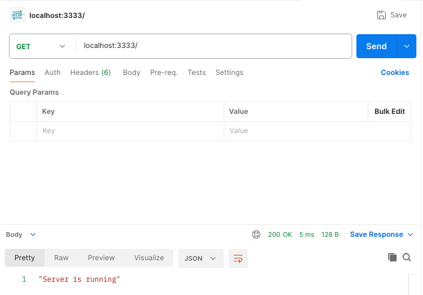
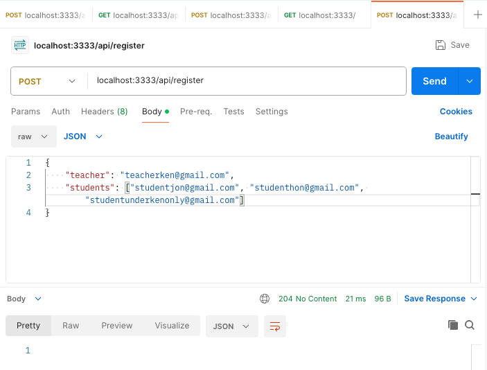
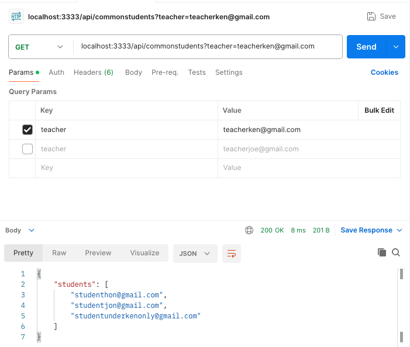
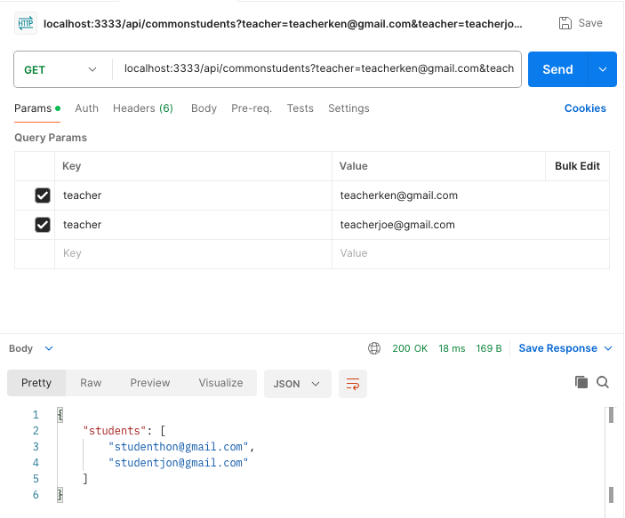
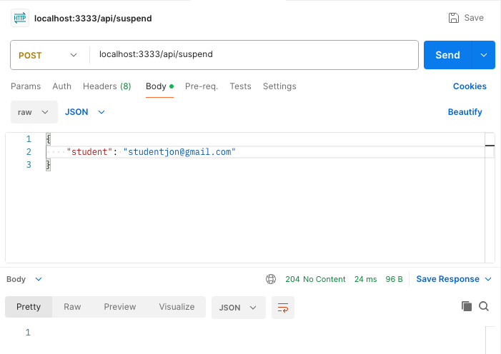
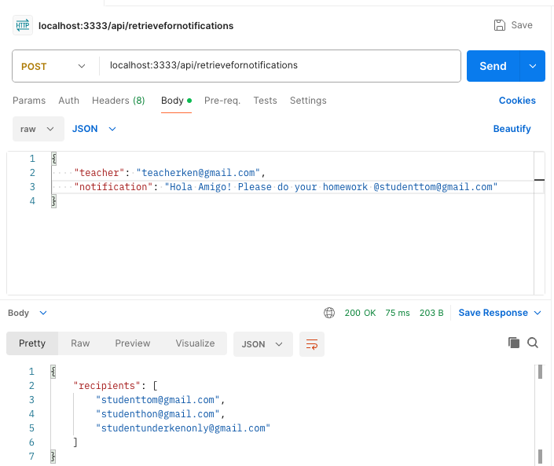
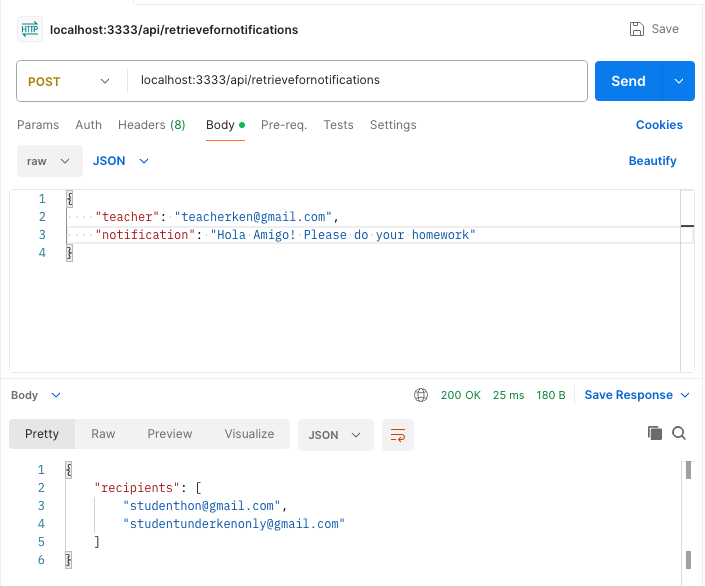

# Golang API Server

This project encapsulates the logic for teacher-student admin system using a Golang API server.

## Table of Contents

- [Installation](#installation)
- [API Endpoints](#api-endpoints)
- [Local Test](#local-test)
- [Postman Test](#postman-test)

## Installation

1. Clone the repository.
2. Setup `.env file` using the `.env.example` as a template.
3. Run `docker-compose up -d` to start the database.
4. Run `go run main.go` to start the server.

## API Endpoints

- `GET /`: Test if server is running.
- `POST /api/register` : Registers one or more students under the specified teacher
  - if the teacher does not exist, error message will be returned
  - if the student does not exist, the entry will be skipped, moving onto next student
  - create the registered pair only if it does not exist in the registries table
- `GET /api/commonstudents` : Retrieve a list of students common to a given list of teachers
  - returns an empty array if no common students are found
- `POST /api/suspend` : Suspend a specified student
  - use 0/1 to indicate if the student is suspended (0 meaning not suspended, 1 meaning suspended)
- `POST /api/retrievefornotifications` : Retrieve a list of students who can receive a given notification

Note that the implementation of these APIs are under the assumption that the teacher/student data already exists in the database.

For example, if a teacher `teacherken@gmail.com` does not exist in the database, trying to registrer students under this teacher will result in an error message being returned.

## Local Test

Note that when switching between local and postman test, it would be good to run `docker-compose down` to clear the database. Then run `docker-compose up -d` to start the database again. This is to ensure that the database is clean and ready for testing.

1. Run `go test ./...` to run all tests.
2. Run `go test -v` to run all tests with verbose output. (Note: there might be some error logs output which is intended)

## Postman Test

The following attached images and description are the Postman tests for the API endpoints.

1. `GET /` : Test if server is running.
   

2. `POST /api/register` : Registers one or more students under the specified teacher
   

3. `GET /api/commonstudents` : Retrieve a list of students common to a given list of teachers (1 teacher)
   

4. `GET /api/commonstudents` : Retrieve a list of students common to a given list of teachers (2 teachers)
   

5. `POST /api/suspend` : Suspend a specified student
   

6. `POST /api/retrievefornotifications` : Retrieve a list of students who can receive a given notification
   

You can see that in the image above, `studentjon@gmail.com` is not included because he has been suspended while `studenttom@gmail.com` though not registered under `teacherken@gmail.com` is included due the @mentioned notification. The other two students `studenthon@gmail.com` and `studentunderkenonly@gmail.com` are both already registered under `teacherken@gmail.com` thus included.

7. `POST /api/retrievefornotifications` : Retrieve a list of students who can receive a given notification (without @mentioned)
   

You can see that in this case `studenttom@gmail.com` will not be retrieved since he is not mentioned in the notification.
